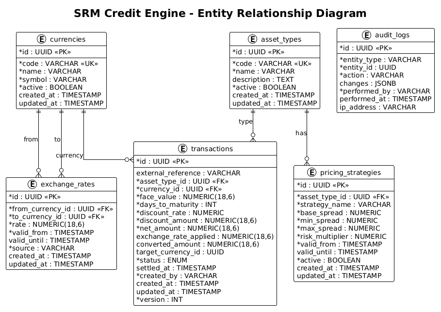

# SRM Credit Engine 💰

[](https://opensource.org/licenses/MIT)
[](https://nodejs.org)
[](https://www.typescriptlang.org/)

Plataforma robusta de cessão de crédito multimoedas (BRL/USD) para fundos de investimento em direitos creditórios (FIDCs).

## 🎯 Contexto Empresarial

A **SRM Asset** opera no mercado de FIDCs, adquirindo ativos financeiros (duplicatas, contratos, recebíveis) de empresas cedentes para prover liquidez ao mercado. Com a globalização do portfólio, o fundo passou a operar com caixa multimoedas, exigindo um sistema robusto para precificar e liquidar ativos com precisão decimal e segurança transacional.

## 📋 Funcionalidades Principais

- 🔄 **Currency Engine**: Gestão de taxas de câmbio com histórico auditável
- 💹 **Pricing Engine**: Motor de precificação com Strategy Pattern para diferentes tipos de ativos
- 🔐 **Transaction Settlement**: Liquidação transacional com garantias ACID
- 📊 **Operator Dashboard**: Interface para mesas de operação
- 🔍 **Analytical Queries**: Extrato de liquidação otimizado para grandes volumes

## 🏗️ Stack Técnica

### Decisão de Stack (ADR-001)

Escolhemos uma stack moderna com tipagem forte e ecossistema maduro, adequada para ambientes financeiros de missão crítica:

#### Backend
- **Runtime**: Node.js 20+ (LTS)
- **Framework**: Fastify (alta performance, baixa latência)
- **Linguagem**: TypeScript 5.3+
- **ORM**: Prisma (type-safe, migrations declarativas)
- **Validação**: Zod (schema validation em runtime)

**Justificativa**: Node.js oferece excelente performance para I/O-bound operations (APIs financeiras), enquanto TypeScript garante type safety crítica para operações monetárias. Fastify supera Express em throughput (~20k req/s vs ~15k req/s).

#### Frontend
- **Framework**: Next.js 14 (App Router)
- **Linguagem**: TypeScript
- **State Management**: Zustand (lightweight, type-safe)
- **UI Components**: shadcn/ui + Tailwind CSS
- **Forms**: React Hook Form + Zod

**Justificativa**: Next.js oferece SSR/SSG out-of-the-box, otimizando performance e SEO. shadcn/ui provê componentes acessíveis e customizáveis sem lock-in de biblioteca.

#### Database
- **SGBD**: PostgreSQL 16+
- **Precision**: NUMERIC(18,6) para valores monetários
- **Migrations**: Prisma Migrate

**Justificativa**: PostgreSQL é o padrão-ouro para aplicações financeiras devido a conformidade ACID robusta, suporte a NUMERIC arbitrary precision (crítico para evitar erros de arredondamento), e performance comprovada em ambientes de produção.

#### DevOps
- **Containerização**: Docker + Docker Compose
- **Monorepo**: Turborepo (cache inteligente, builds paralelos)
- **CI/CD**: GitHub Actions
- **Linting**: ESLint + Prettier
- **Git Hooks**: Husky + Commitlint

**Justificativa**: Turborepo otimiza builds em monorepos (até 10x mais rápido que Lerna). Docker garante paridade dev/prod. GitHub Actions oferece integração nativa com repositórios.

## 🏛️ Arquitetura

### Padrão: Monorepo com 3-Tier Architecture

```
srm-credit-engine/
├── apps/
│   ├── backend/          # API Node.js/Fastify
│   │   ├── src/
│   │   │   ├── presentation/    # Controllers, Routes, Middlewares
│   │   │   ├── business/        # Services, Strategies, Domain Logic
│   │   │   └── persistence/     # Repositories, Prisma Client
│   │   └── prisma/              # Schema, Migrations
│   └── web/              # Frontend Next.js
│       └── src/
│           ├── app/             # App Router (Next.js 14)
│           ├── components/      # UI Components
│           ├── lib/             # Utilities, Hooks
│           └── services/        # API Clients
├── packages/
│   └── shared/           # Types, Schemas, Validations compartilhados
├── docs/
│   ├── adr/              # Architecture Decision Records
│   └── diagrams/         # C4, ER Diagrams
└── .github/
    └── workflows/        # CI/CD Pipelines
```

### Camadas (3-Tier)

1. **Presentation Layer**: Recebe requests HTTP, valida inputs, retorna responses
2. **Business Layer**: Contém lógica de negócio (precificação, conversão cambial)
3. **Persistence Layer**: Acesso a dados, queries, transações

**Exceção**: Relatórios analíticos podem pular a camada de negócio para otimização de queries.

### Diagramas

- [C4 - Context Diagram](./docs/diagrams/c4-context.png)
- [C4 - Container Diagram](./docs/diagrams/c4-container.png)
- [Entity-Relationship Diagram](./docs/diagrams/er-diagram.png)

Fontes PlantUML e instruções de regeneração: [docs/diagrams/README.md](./docs/diagrams/README.md)

## 🚀 Quick Start

### Pré-requisitos

- Node.js >= 20.11.0 (verifique com `node -v`)
- Docker >= 24.0
- Docker Compose >= 2.20
- npm >= 10.0

### Instalação

```bash
# Clone o repositório
git clone https://github.com/seu-usuario/srm-credit-engine.git
cd srm-credit-engine

# Instale dependências (workspaces Turborepo)
npm install

# Configure variáveis de ambiente
cp apps/backend/.env.example apps/backend/.env
cp apps/web/.env.example apps/web/.env

# Suba os serviços (PostgreSQL, Backend, Frontend)
docker-compose up -d

# Execute migrations
npm run migrate:dev -w apps/backend

# Acesse a aplicação
# - Frontend: http://localhost:3000
# - Backend API: http://localhost:4000
# - Swagger Docs: http://localhost:4000/docs
```

### Scripts Disponíveis

```bash
npm run dev              # Inicia backend + frontend em modo dev
npm run build            # Build de produção de todos os apps
npm run lint             # Linting com ESLint
npm run test             # Executa testes
npm run test:coverage    # Testes com coverage report
npm run format           # Formata código com Prettier
```

## 🔄 Git Workflow

### Branching Strategy: GitHub Flow (simplificado)

Adotamos **GitHub Flow** por ser adequado para entregas contínuas e times pequenos:

1. **Branch `main`**: sempre deployável (produção)
2. **Feature branches**: `feature/nome-da-funcionalidade`
3. **Bugfix branches**: `fix/nome-do-bug`
4. **Pull Requests**: obrigatórios antes de merge na `main`

```bash
# Criar feature branch
git checkout -b feature/currency-engine

# Commits seguindo Conventional Commits
git commit -m "feat(currency): add exchange rate model"

# Push e abrir PR
git push origin feature/currency-engine
```

### Conventional Commits (Obrigatório)

Formato: `<type>(<scope>): <subject>`

**Types permitidos**:
- `feat`: Nova funcionalidade
- `fix`: Correção de bug
- `docs`: Documentação
- `refactor`: Refatoração de código
- `test`: Adição/modificação de testes
- `chore`: Tarefas de build, CI, deps

**Exemplos**:
```
feat(pricing): implement duplicata strategy
fix(settlement): prevent race condition in optimistic locking
docs(readme): add setup instructions
test(currency): add unit tests for exchange rate calculation
```

**Validação**: Commitlint bloqueia commits fora do padrão via Husky pre-commit hook.

### Pull Request Template

```markdown
## Descrição
[Descreva o que foi feito]

## Issue Linear
Closes DUP-XXX

## Checklist
- [ ] Testes adicionados/atualizados
- [ ] Documentação atualizada
- [ ] Migrations criadas (se aplicável)
- [ ] Build local passou
- [ ] Lint/format passou
```

## 📊 Modelagem de Dados

### ER Diagram


### Tabelas Principais

- `currencies`: Moedas suportadas (BRL, USD)
- `exchange_rates`: Taxas de câmbio com histórico (valid_from)
- `asset_types`: Tipos de recebíveis (Duplicata, Cheque, etc)
- `pricing_strategies`: Configuração de spreads por tipo
- `transactions`: Registro de liquidações com audit trail

**Precisão Numérica**: Todos os valores monetários usam `NUMERIC(18,6)` para evitar erros de arredondamento de ponto flutuante.

## 🧪 Testes

```bash
# Rodar testes unitários
npm run test

# Testes com coverage (mínimo 80%)
npm run test:coverage

# Testes de integração (Testcontainers)
npm run test:integration
```

**Estratégia de Testes**:
- **Unit Tests**: Strategies de precificação, conversão cambial
- **Integration Tests**: Transações ACID, concorrência
- **Contract Tests**: Schemas OpenAPI

## 📈 Observabilidade

- **Logs Estruturados**: JSON format com Pino (high-performance logger)
- **Métricas**: Prometheus-compatible endpoint `/metrics`
- **Healthchecks**: 
  - `/health` (liveness probe)
  - `/health/ready` (readiness probe - valida conexão DB)
- **Correlation ID**: Rastreamento de requests end-to-end

## 🔐 Segurança

- ✅ Prepared Statements (proteção contra SQL Injection)
- ✅ Input validation (Zod schemas)
- ✅ Secrets via variáveis de ambiente (nunca hardcoded)
- ✅ HTTPS enforcement (produção)
- ✅ Optimistic Locking (prevenção de race conditions)
- ✅ Rate Limiting (proteção contra DDoS)

## 🗂️ ADRs (Architecture Decision Records)

Decisões arquiteturais importantes estão documentadas em:

- [ADR-001: Stack Selection](./docs/adr/001-stack-selection.md)
- [ADR-002: SQL vs NoSQL](./docs/adr/002-sql-vs-nosql.md)
- [ADR-003: Monolith-First Approach](./docs/adr/003-monolith-first.md)
- [ADR-004: Pricing Strategy Pattern](./docs/adr/004-pricing-strategy-pattern.md) *(pendente)*

## 📦 Milestones & Roadmap

- [x] **M0: Foundation** (Semana 1) - Setup completo
- [ ] **M1: Core Engine MVP** (Semanas 2-3) - Pricing + Settlement
- [ ] **M2: API Production-Ready** (Semana 4) - Swagger, validations
- [ ] **M3: Operator Dashboard** (Semana 5) - Frontend completo
- [ ] **M4: Hardening** (Semana 6) - Observability, security
- [ ] **M5: Automation** (Semana 7) - CI/CD, docs, v1.0.0

Ver [Plano Detalhado](./docs/IMPLEMENTATION_PLAN.md) para breakdown completo de issues.

## 🤖 AI Usage

Este projeto foi desenvolvido com auxílio de LLMs (Claude Sonnet 4.5). Veja [AI_USAGE.md](./AI_USAGE.md) para:
- Prompts estratégicos utilizados
- Casos de alucinação e correções aplicadas
- Análise crítica de produtividade

**Princípio**: IA como co-pilot, não como autopilot. Todo código gerado foi revisado, compreendido e adaptado.

## 📄 Licença

Este projeto está sob a licença MIT. Ver arquivo [LICENSE](./LICENSE).

## 👥 Autores

- **Kaique Bernardo** - *Desenvolvimento Inicial* - [@kaiquebernardo](https://github.com/kaiquebernardo)

**Co-Authored-By:** Claude Sonnet 4.5 <noreply@anthropic.com>

## 🔗 Links Úteis

- [Documentação da API (Swagger)](http://localhost:4000/docs)
- [Linear Project](https://linear.app/dupappbr/project/srm-credit-engine-f7e7a0ea1750)
- [Conventional Commits](https://www.conventionalcommits.org/)
- [Turborepo Docs](https://turbo.build/repo/docs)
