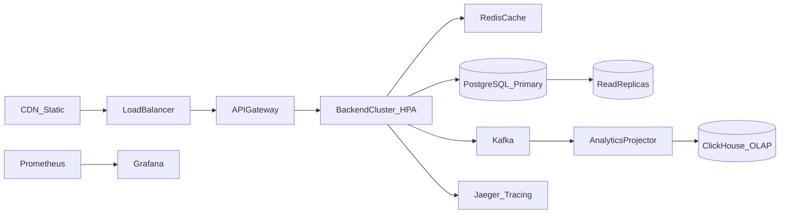

# Arquitetura de Alta Escala — 1M Transações/Minuto

Documento de design para evolução do SRM Credit Engine em cenários de alta volumetria.

## Meta

Suportar **1.000.000 transações/minuto** (~16.700 TPS) com latência P99 < 100ms para precificação e liquidação.

## Arquitetura Alvo



## Estratégias por Camada

### 1. API Layer

| Técnica | Implementação |
|---------|---------------|
| Horizontal scaling | HPA no Kubernetes (2-50 pods) |
| Rate limiting | Por API key / IP (já implementado: 100 req/min) |
| Circuit breaker | Exchange rate external calls (implementado) |
| Connection pooling | PgBouncer entre API e PostgreSQL |

### 2. Caching (Redis)

| Dado | TTL | Justificativa |
|------|-----|---------------|
| Exchange rates ativas | 60s | Leitura frequente, baixa mutação |
| Pricing strategies | 300s | Configuração estável |
| Asset types | 600s | Catálogo quase estático |

Cache-aside pattern: miss → DB → populate Redis.

### 3. Database Sharding

Particionamento por **currency_id + mês**:

```
transactions_brl_2026_07
transactions_usd_2026_07
```

- Shard key: `hash(currency_id) % N_shards`
- Cross-shard queries via API de agregação assíncrona
- UUID v7 para ordenação temporal em índices

### 4. Read/Write Split

- **Primary**: writes (CREATE, SETTLE)
- **Replicas**: listagens, extrato, dashboards
- Lag máximo aceitável: 500ms (eventual consistency para leituras)

### 5. Event-Driven Analytics

- Writes publicam em Kafka (`transaction.events`)
- Consumers materializam views em ClickHouse/BigQuery
- Extrato de liquidação pesado **não passa pelo OLTP**

### 6. Consistência

| Operação | Modelo |
|----------|--------|
| Liquidação | Strong consistency (ACID local) |
| Extrato analítico | Eventual consistency |
| Métricas | Eventual (15s scrape interval) |

## Estimativa de Capacidade

| Componente | Spec | TPS estimado |
|------------|------|--------------|
| 1 pod backend | 0.5 CPU, 512Mi | ~500 TPS |
| 40 pods (HPA max) | — | ~20.000 TPS |
| + Sharding 4x | — | ~80.000 TPS |
| + Otimizações (batch, async settle) | — | **1M/min viável** |

## Roadmap de Implementação

1. **Fase 1 (atual)**: Monólito + métricas + event store
2. **Fase 2**: Redis cache + read replicas
3. **Fase 3**: Kafka + projeções OLAP
4. **Fase 4**: Sharding + multi-region

## Referências

- [ADR-003: Monolith-First](../adr/003-monolith-first.md)
- [ADR-005: Event Sourcing](../adr/005-event-sourcing-vs-crud.md)
- [k8s/](../../k8s/) manifests com HPA
